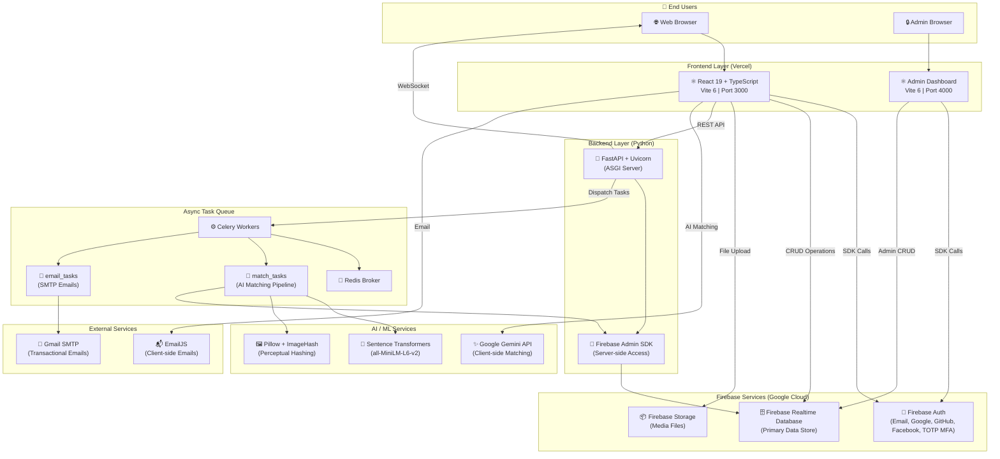
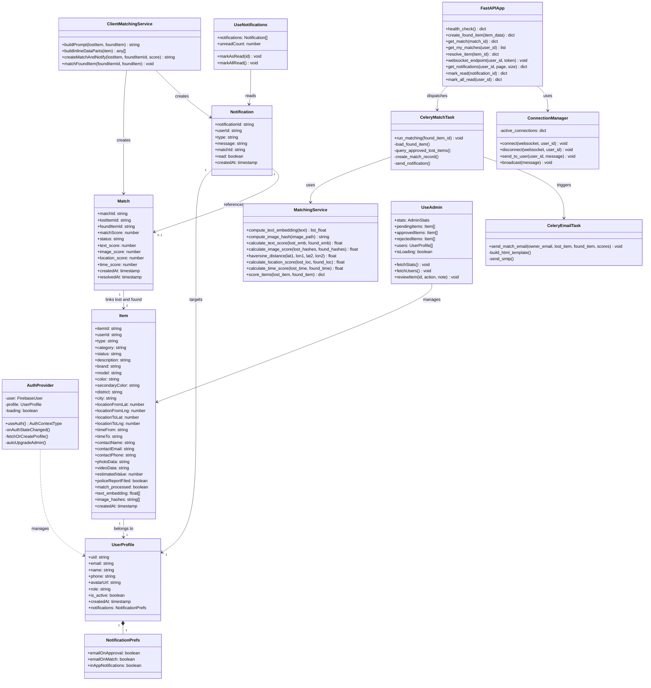
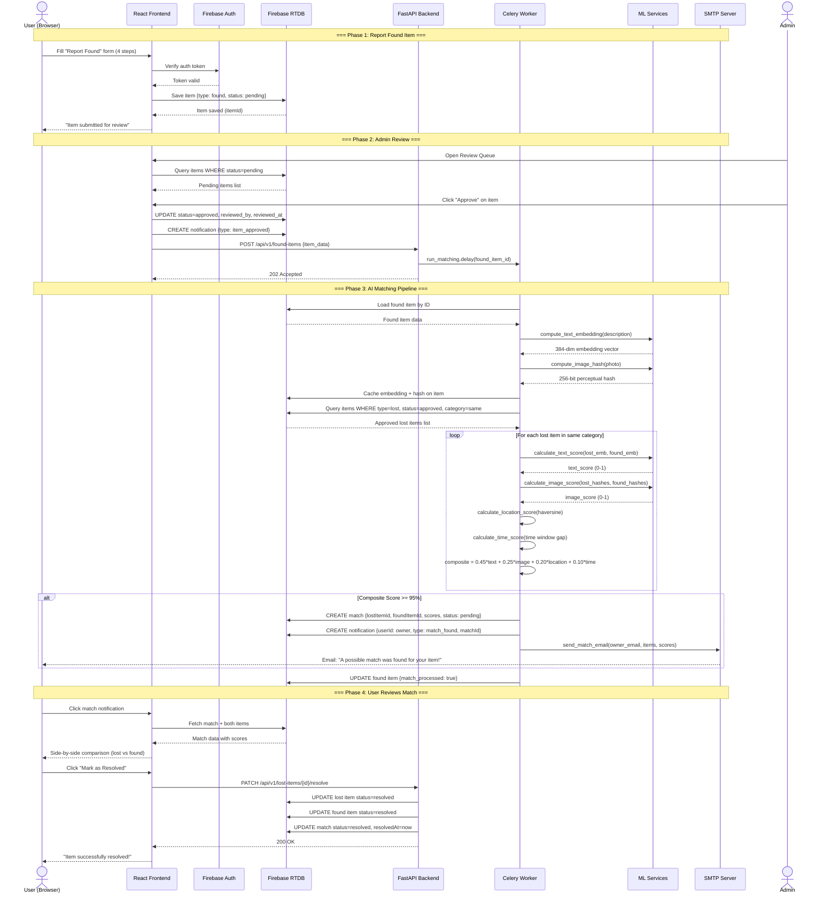

# KhojTalas — System Design & Diagrams

**Version:** 1.0.0  
**Last Updated:** April 9, 2026  
**Project:** KhojTalas — Nepal Lost & Found Platform

---

## Table of Contents

- [5.1 Architecture Diagram](#51-architecture-diagram)
- [5.2 ER Diagram](#52-er-diagram)
- [5.3 Database Design](#53-database-design)
  - [5.3.1 Database Schema](#531-database-schema)
  - [5.3.2 Table Structures](#532-table-structures)
  - [5.3.3 Normalization (1NF, 2NF, 3NF)](#533-normalization-1nf-2nf-3nf)
  - [5.3.4 Constraints (PK, FK, Unique, Not Null)](#534-constraints-pk-fk-unique-not-null)
- [5.4 UML Diagrams](#54-uml-diagrams)
  - [5.4.1 Class Diagram](#541-class-diagram)
  - [5.4.2 Sequence Diagram](#542-sequence-diagram)
  - [5.4.3 Use Case Diagram](#543-use-case-diagram)

---

## 5.1 Architecture Diagram

The system follows a **decoupled three-tier architecture** with a React frontend, Firebase as the middleware/database layer, and a Python FastAPI backend with an async Celery task queue.



### Architecture Components Summary

| Layer | Component | Technology | Responsibility |
|-------|-----------|-----------|----------------|
| **Presentation** | Main App | React 19 + Vite 6 | User-facing UI (report, browse, match review) |
| **Presentation** | Admin App | React 19 + Vite 6 | Admin dashboard (review queue, user mgmt) |
| **Service** | Firebase Auth | Firebase SDK 12 | Authentication (Email, OAuth, TOTP MFA) |
| **Data** | Firebase RTDB | Firebase Realtime DB | Primary data store for all collections |
| **Data** | Firebase Storage | Firebase Storage | Media file storage (photos, videos) |
| **Application** | FastAPI Server | Python + Uvicorn | REST API + WebSocket notifications |
| **Processing** | Celery Workers | Celery + Redis | Async AI matching & email delivery |
| **AI/ML** | Text Matching | Sentence Transformers | 384-dim NLP embeddings + cosine similarity |
| **AI/ML** | Image Matching | Pillow + ImageHash | Perceptual hashing (pHash) |
| **AI/ML** | Multi-modal | Google Gemini API | Client-side AI matching with vision |
| **External** | Email (Server) | Gmail SMTP | Match notification emails |
| **External** | Email (Client) | EmailJS | Lightweight client-side emails |

---

## 5.2 ER Diagram

The Entity-Relationship diagram shows the four primary entities and their relationships in the KhojTalas database.

```mermaid
erDiagram
    USERS {
        string uid PK "Firebase Auth UID"
        string email "User email (unique)"
        string name "Display name"
        string phone "Nepal phone 98/97XXXXXXXX"
        string avatarUrl "Profile picture URL/Base64"
        string role "user | admin"
        boolean is_active "Account active status"
        timestamp createdAt "Account creation time"
        boolean notif_emailOnApproval "Email on approval pref"
        boolean notif_emailOnMatch "Email on match pref"
        boolean notif_inAppNotifications "In-app notif pref"
    }

    ITEMS {
        string itemId PK "Auto-generated ID"
        string userId FK "Owner UID → USERS.uid"
        string type "lost | found"
        string category "Electronics Pets etc"
        string status "pending | approved | rejected | resolved"
        string description "Free-text description"
        string brand "Item brand"
        string model "Item model"
        string color "Primary color"
        string secondaryColor "Secondary color"
        string district "Nepal district"
        string city "Municipality"
        float locationFromLat "From latitude"
        float locationFromLng "From longitude"
        float locationToLat "To latitude (lost only)"
        float locationToLng "To longitude (lost only)"
        string lostLocationDescription "Lost location text"
        string foundLocationDescription "Found location text"
        string timeFrom "ISO timestamp start"
        string timeTo "ISO timestamp end"
        string contactName "Reporter name"
        string contactEmail "Reporter email"
        string contactPhone "Reporter phone"
        string photoData "Base64 photo max 250KB"
        string videoData "Base64 video max 400KB"
        float estimatedValue "Value or reward"
        boolean policeReportFiled "Police report filed"
        string policeReportNumber "Report number"
        boolean match_processed "Matching completed"
        string text_embedding "Cached 384-dim embedding"
        string image_hashes "Cached perceptual hashes"
        timestamp createdAt "Submission timestamp"
        string reviewed_by "Admin UID who reviewed"
        timestamp reviewed_at "Review timestamp"
        string admin_note "Admin review note"
    }

    MATCHES {
        string matchId PK "Auto-generated ID"
        string lostItemId FK "Lost item ref → ITEMS.itemId"
        string foundItemId FK "Found item ref → ITEMS.itemId"
        float matchScore "Composite score 0-100"
        string status "pending | resolved | rejected"
        float text_score "Text similarity 0-1"
        float image_score "Image similarity 0-1"
        float location_score "Location proximity 0-1"
        float time_score "Time overlap 0-1"
        timestamp createdAt "Match creation time"
        timestamp resolvedAt "Match resolution time"
    }

    NOTIFICATIONS {
        string notificationId PK "Auto-generated ID"
        string userId FK "Target user → USERS.uid"
        string type "match_found | item_approved | item_rejected | system"
        string message "Notification text"
        string matchId FK "Optional → MATCHES.matchId"
        boolean read "Read or unread status"
        timestamp createdAt "Notification creation time"
    }

    USERS ||--o{ ITEMS : "reports"
    USERS ||--o{ NOTIFICATIONS : "receives"
    ITEMS ||--o{ MATCHES : "lost item in match"
    ITEMS ||--o{ MATCHES : "found item in match"
    MATCHES ||--o{ NOTIFICATIONS : "triggers"
```



### Relationship Summary

| Relationship | Cardinality | Description |
|-------------|-------------|-------------|
| USERS → ITEMS | One-to-Many | A user can report multiple lost/found items |
| USERS → NOTIFICATIONS | One-to-Many | A user can receive multiple notifications |
| ITEMS → MATCHES (lost) | One-to-Many | A lost item can appear in multiple matches |
| ITEMS → MATCHES (found) | One-to-Many | A found item can appear in multiple matches |
| MATCHES → NOTIFICATIONS | One-to-Many | A match can trigger multiple notifications |

---

## 5.3 Database Design

### 5.3.1 Database Schema

KhojTalas uses **Firebase Realtime Database (RTDB)** — a NoSQL, JSON-based cloud database. While RTDB is schema-less, the application enforces a consistent schema through application-level validation and security rules.

**Database Path Structure:**

```
root/
├── users/
│   └── {uid}/                    → User profile document
├── items/
│   └── {itemId}/                 → Item report document
├── matches/
│   └── {matchId}/                → Match result document
└── notifications/
    └── {notificationId}/         → Notification document
```

**Indexes (defined in `database.rules.json`):**

```json
{
  "items":         { ".indexOn": ["status", "userId", "type", "createdAt"] },
  "matches":       { ".indexOn": ["status", "lostItemId", "foundItemId"] },
  "notifications": { ".indexOn": ["userId", "read", "createdAt"] }
}
```

---

### 5.3.2 Table Structures

Although Firebase RTDB is a NoSQL document store, the following presents the logical table structures in a relational format for documentation purposes.

#### Table 1: USERS

| # | Field Name | Data Type | Size/Format | Required | Default | Description |
|---|-----------|-----------|-------------|----------|---------|-------------|
| 1 | `uid` | STRING | 28 chars (Firebase UID) | Yes | Auto (Firebase Auth) | Primary Key — Firebase Auth UID |
| 2 | `email` | STRING | max 254 chars | Yes | — | User's email address (Unique) |
| 3 | `name` | STRING | max 100 chars | Yes | — | Display name |
| 4 | `phone` | STRING | 10 digits | No | NULL | Nepal phone (`^(98\|97)\d{8}$`) |
| 5 | `avatarUrl` | STRING (TEXT) | URL or Base64 | No | NULL | Profile picture |
| 6 | `role` | STRING (ENUM) | `user` \| `admin` | Yes | `"user"` | User role |
| 7 | `is_active` | BOOLEAN | true/false | No | `true` | Account status |
| 8 | `createdAt` | TIMESTAMP | ISO 8601 | Yes | Auto | Account creation timestamp |
| 9 | `notifications.emailOnApproval` | BOOLEAN | true/false | No | `true` | Email on item approval |
| 10 | `notifications.emailOnMatch` | BOOLEAN | true/false | No | `true` | Email on match found |
| 11 | `notifications.inAppNotifications` | BOOLEAN | true/false | No | `true` | In-app notification toggle |

#### Table 2: ITEMS

| # | Field Name | Data Type | Size/Format | Required | Default | Description |
|---|-----------|-----------|-------------|----------|---------|-------------|
| 1 | `itemId` | STRING | Auto-generated push key | Yes | Auto | Primary Key |
| 2 | `userId` | STRING | 28 chars | Yes | — | Foreign Key → USERS.uid |
| 3 | `type` | STRING (ENUM) | `lost` \| `found` | Yes | — | Report type |
| 4 | `category` | STRING (ENUM) | 12+ categories | Yes | — | Item category |
| 5 | `status` | STRING (ENUM) | `pending`\|`approved`\|`rejected`\|`resolved` | Yes | `"pending"` | Review status |
| 6 | `description` | STRING (TEXT) | max 2000 chars | Yes | — | Free-text description |
| 7 | `brand` | STRING | max 100 chars | No | NULL | Item brand |
| 8 | `model` | STRING | max 100 chars | No | NULL | Item model |
| 9 | `color` | STRING | max 50 chars | No | NULL | Primary color |
| 10 | `secondaryColor` | STRING | max 50 chars | No | NULL | Secondary color |
| 11 | `district` | STRING | Nepal district name | No | NULL | District (77 options) |
| 12 | `city` | STRING | City/municipality | No | NULL | City within district |
| 13 | `locationFromLat` | FLOAT | -90.0 to 90.0 | Yes | — | From-point latitude |
| 14 | `locationFromLng` | FLOAT | -180.0 to 180.0 | Yes | — | From-point longitude |
| 15 | `locationToLat` | FLOAT | -90.0 to 90.0 | No | NULL | To-point latitude (lost only) |
| 16 | `locationToLng` | FLOAT | -180.0 to 180.0 | No | NULL | To-point longitude (lost only) |
| 17 | `lostLocationDescription` | STRING (TEXT) | max 500 chars | No | NULL | Lost location text |
| 18 | `foundLocationDescription` | STRING (TEXT) | max 500 chars | No | NULL | Found location text |
| 19 | `timeFrom` | STRING | ISO 8601 datetime | Yes | — | When lost/found (start) |
| 20 | `timeTo` | STRING | ISO 8601 datetime | No | NULL | When lost (end of window) |
| 21 | `contactName` | STRING | max 100 chars | Yes | — | Reporter name |
| 22 | `contactEmail` | STRING | max 254 chars | Yes | — | Reporter email |
| 23 | `contactPhone` | STRING | 10 digits | Yes | — | Reporter phone |
| 24 | `photoData` | STRING (BLOB) | max 250 KB (Base64) | No | NULL | Item photo |
| 25 | `videoData` | STRING (BLOB) | max 400 KB (Base64) | No | NULL | Item video |
| 26 | `estimatedValue` | FLOAT | ≥ 0 | No | NULL | Estimated value / reward |
| 27 | `policeReportFiled` | BOOLEAN | true/false | No | `false` | Police report filed? |
| 28 | `policeReportNumber` | STRING | max 50 chars | No | NULL | Police report number |
| 29 | `match_processed` | BOOLEAN | true/false | No | `false` | Matching completed? |
| 30 | `text_embedding` | ARRAY (FLOAT) | 384 dimensions | No | NULL | Cached text embedding vector |
| 31 | `image_hashes` | ARRAY (STRING) | pHash strings | No | NULL | Cached perceptual hashes |
| 32 | `createdAt` | TIMESTAMP | ISO 8601 | Yes | Auto | Submission timestamp |
| 33 | `reviewed_by` | STRING | Admin UID | No | NULL | Admin who reviewed |
| 34 | `reviewed_at` | TIMESTAMP | ISO 8601 | No | NULL | Review timestamp |
| 35 | `admin_note` | STRING (TEXT) | max 500 chars | No | NULL | Admin review note |

**Category-Specific Fields (conditional, based on `category`):**

| Category | Extra Fields |
|----------|-------------|
| Electronics | `os` (STRING), `storage` (STRING) |
| Pets | `name` (STRING), `breed` (STRING), `microchipId` (STRING), `collarColor` (STRING), `age` (STRING) |
| Person | `name` (STRING), `age` (NUMBER), `gender` (STRING), `height` (STRING), `lastSeenWearing` (STRING) |
| Wallet/Money | `documentType` (STRING), `contents` (STRING) |
| Jewelry | `material` (STRING), `jewelryWeight` (STRING) |
| Keys | `numberOfKeys` (NUMBER), `keyType` (STRING), `keychain` (STRING) |
| Vehicles | `vehicleType` (STRING), `licensePlate` (STRING), `vin` (STRING) |
| Clothing | `brand` (STRING), `size` (STRING) |
| Musical Instruments | `instrumentType` (STRING), `serialNumber` (STRING) |
| Glasses | `eyewearType` (STRING), `frameColor` (STRING), `lensColor` (STRING) |
| Bags | `brand` (STRING), `contents` (STRING) |

#### Table 3: MATCHES

| # | Field Name | Data Type | Size/Format | Required | Default | Description |
|---|-----------|-----------|-------------|----------|---------|-------------|
| 1 | `matchId` | STRING | Auto-generated push key | Yes | Auto | Primary Key |
| 2 | `lostItemId` | STRING | Item push key | Yes | — | FK → ITEMS.itemId (lost) |
| 3 | `foundItemId` | STRING | Item push key | Yes | — | FK → ITEMS.itemId (found) |
| 4 | `matchScore` | FLOAT | 0–100 | Yes | — | Composite match score |
| 5 | `status` | STRING (ENUM) | `pending`\|`resolved`\|`rejected` | Yes | `"pending"` | Match status |
| 6 | `text_score` | FLOAT | 0.0–1.0 | Yes | — | Text similarity score |
| 7 | `image_score` | FLOAT | 0.0–1.0 | Yes | — | Image similarity score |
| 8 | `location_score` | FLOAT | 0.0–1.0 | Yes | — | Location proximity score |
| 9 | `time_score` | FLOAT | 0.0–1.0 | Yes | — | Time overlap score |
| 10 | `createdAt` | TIMESTAMP | ISO 8601 | Yes | Auto | Match creation timestamp |
| 11 | `resolvedAt` | TIMESTAMP | ISO 8601 | No | NULL | Resolution timestamp |

#### Table 4: NOTIFICATIONS

| # | Field Name | Data Type | Size/Format | Required | Default | Description |
|---|-----------|-----------|-------------|----------|---------|-------------|
| 1 | `notificationId` | STRING | Auto-generated push key | Yes | Auto | Primary Key |
| 2 | `userId` | STRING | 28 chars | Yes | — | FK → USERS.uid |
| 3 | `type` | STRING (ENUM) | `match_found`\|`item_approved`\|`item_rejected`\|`system` | Yes | — | Notification type |
| 4 | `message` | STRING (TEXT) | max 500 chars | Yes | — | Notification message |
| 5 | `matchId` | STRING | Match push key | No | NULL | FK → MATCHES.matchId |
| 6 | `read` | BOOLEAN | true/false | Yes | `false` | Read/unread status |
| 7 | `createdAt` | TIMESTAMP | ISO 8601 | Yes | Auto | Creation timestamp |

---

### 5.3.3 Normalization (1NF, 2NF, 3NF)

Although Firebase RTDB is a NoSQL database, KhojTalas's data model is designed to follow relational normalization principles where applicable.

#### First Normal Form (1NF)

> **Rule:** Every column must contain atomic (indivisible) values. No repeating groups.

| Table | 1NF Compliance | Analysis |
|-------|---------------|----------|
| **USERS** | ✅ Compliant | All fields are atomic. Notification preferences are stored as individual boolean fields (`emailOnApproval`, `emailOnMatch`, `inAppNotifications`) rather than as an array. |
| **ITEMS** | ⚠️ Partial | `text_embedding` (384-element float array) and `image_hashes` (string array) are multi-valued. However, these are **cached computed values** used only by the matching engine, not user-facing data. They are stored as arrays for performance optimization. All user-facing fields are atomic. |
| **MATCHES** | ✅ Compliant | All fields are atomic scalar values. Individual score components are stored as separate fields (`text_score`, `image_score`, `location_score`, `time_score`). |
| **NOTIFICATIONS** | ✅ Compliant | All fields are atomic. |

**1NF Resolution for ITEMS:** The `text_embedding` and `image_hashes` fields are computed caches, not primary data. If strict 1NF were required, they could be extracted to a separate `ITEM_EMBEDDINGS` table:

```
ITEM_EMBEDDINGS (itemId FK, dimension_index INT, value FLOAT)
ITEM_IMAGE_HASHES (itemId FK, hash_index INT, hash_value STRING)
```

However, this is not done because:
1. These are transient computed caches, not user data
2. Separating them would severely degrade matching performance
3. They are accessed atomically (always read/written as a complete set)

#### Second Normal Form (2NF)

> **Rule:** Must be in 1NF and every non-key attribute must depend on the entire primary key (no partial dependencies).

| Table | Primary Key | 2NF Compliance | Analysis |
|-------|------------|---------------|----------|
| **USERS** | `uid` (single) | ✅ Compliant | Single-column PK — partial dependency is impossible. All fields (`email`, `name`, `phone`, `role`, etc.) depend fully on `uid`. |
| **ITEMS** | `itemId` (single) | ✅ Compliant | Single-column PK. All fields (`userId`, `type`, `category`, `description`, etc.) depend fully on `itemId`. |
| **MATCHES** | `matchId` (single) | ✅ Compliant | Single-column PK. `lostItemId`, `foundItemId`, scores all depend fully on `matchId`. Note: `(lostItemId, foundItemId)` forms a natural candidate key. |
| **NOTIFICATIONS** | `notificationId` (single) | ✅ Compliant | Single-column PK. All fields depend on `notificationId`. |

**2NF Analysis:** All tables use single-column primary keys (auto-generated push IDs), so partial dependencies cannot exist. The schema is inherently in 2NF.

#### Third Normal Form (3NF)

> **Rule:** Must be in 2NF and no non-key attribute should depend on another non-key attribute (no transitive dependencies).

| Table | 3NF Compliance | Analysis |
|-------|---------------|----------|
| **USERS** | ✅ Compliant | No transitive dependencies. All fields are directly about the user. |
| **ITEMS** | ⚠️ Intentional Denormalization | `contactName`, `contactEmail`, `contactPhone` could be derived from `userId → USERS`. These are intentionally denormalized for: (1) reporters may use different contact info per item, (2) performance — avoids a JOIN/lookup on every item display, (3) data independence — contact info persists even if user modifies profile. Additionally, `district` and `city` have a dependency (`city` → `district`), but are denormalized since Nepal's administrative hierarchy is static. |
| **MATCHES** | ✅ Compliant | `matchScore` could be derived from the four component scores (text, image, location, time), but is stored for query performance and threshold filtering. All fields depend directly on the match, not on each other. |
| **NOTIFICATIONS** | ✅ Compliant | All fields depend directly on the notification. `userId` and `matchId` are foreign keys, not transitive dependencies. |

**3NF Denormalization Justification for ITEMS:**

| Denormalized Fields | Reason | Trade-off |
|---|---|---|
| `contactName/Email/Phone` | User may provide different contact info per report | Slight data redundancy vs. flexibility |
| `district` + `city` | Static Nepal hierarchy; always queried together | Avoids lookup table JOIN |
| `reviewed_by` + `reviewed_at` + `admin_note` | Admin review metadata on the item itself | Avoids a separate REVIEWS table for a 1:1 relationship |

**Normalized Alternative (if strict 3NF required):**

```
CONTACTS (contactId PK, name, email, phone)
ITEMS.contactId FK → CONTACTS.contactId

LOCATIONS (locationId PK, district, city, lat, lng, description)
ITEMS.locationFromId FK → LOCATIONS.locationId
ITEMS.locationToId FK → LOCATIONS.locationId

REVIEWS (reviewId PK, itemId FK, adminId FK, action, note, timestamp)
```

> **Design Decision:** KhojTalas intentionally uses controlled denormalization for performance and simplicity, as the application is read-heavy and Firebase RTDB does not support JOIN operations.

---

### 5.3.4 Constraints (PK, FK, Unique, Not Null)

Since Firebase RTDB does not enforce constraints at the database level, all constraints are enforced through **application-level validation** and **Firebase Security Rules**.

#### Primary Key Constraints

| Table | PK Field | Type | Generation Method |
|-------|---------|------|-------------------|
| USERS | `uid` | STRING(28) | Firebase Auth auto-generated UID |
| ITEMS | `itemId` | STRING(20) | Firebase RTDB `push()` key |
| MATCHES | `matchId` | STRING(20) | Firebase RTDB `push()` key |
| NOTIFICATIONS | `notificationId` | STRING(20) | Firebase RTDB `push()` key |

All primary keys are:
- **Unique** — guaranteed by Firebase (`push()` generates time-based unique IDs)
- **Not Null** — required for record creation
- **Immutable** — never updated after creation

#### Foreign Key Constraints

| Table | FK Field | References | On Delete | Enforcement |
|-------|---------|-----------|-----------|-------------|
| ITEMS | `userId` | USERS.`uid` | Application-level cascade | Security rules verify auth.uid matches |
| ITEMS | `reviewed_by` | USERS.`uid` | SET NULL | Application-level |
| MATCHES | `lostItemId` | ITEMS.`itemId` | Restrict (match persists) | Application-level check before creation |
| MATCHES | `foundItemId` | ITEMS.`itemId` | Restrict (match persists) | Application-level check before creation |
| NOTIFICATIONS | `userId` | USERS.`uid` | Cascade (delete with user) | Application-level |
| NOTIFICATIONS | `matchId` | MATCHES.`matchId` | SET NULL | Optional field |

#### Unique Constraints

| Table | Field(s) | Scope | Enforcement |
|-------|---------|-------|-------------|
| USERS | `uid` | Global | Firebase Auth (system-guaranteed) |
| USERS | `email` | Global | Firebase Auth (system-guaranteed) |
| ITEMS | `itemId` | Global | Firebase RTDB push key (system-guaranteed) |
| MATCHES | `(lostItemId, foundItemId)` | Composite | Application-level check in `run_matching()` — prevents duplicate matches between the same pair |
| MATCHES | `matchId` | Global | Firebase RTDB push key (system-guaranteed) |
| NOTIFICATIONS | `notificationId` | Global | Firebase RTDB push key (system-guaranteed) |

#### Not Null Constraints

| Table | Not Null Fields |
|-------|----------------|
| **USERS** | `uid`, `email`, `name`, `role`, `createdAt` |
| **ITEMS** | `itemId`, `userId`, `type`, `category`, `status`, `description`, `locationFromLat`, `locationFromLng`, `timeFrom`, `contactName`, `contactEmail`, `contactPhone`, `createdAt` |
| **MATCHES** | `matchId`, `lostItemId`, `foundItemId`, `matchScore`, `status`, `text_score`, `image_score`, `location_score`, `time_score`, `createdAt` |
| **NOTIFICATIONS** | `notificationId`, `userId`, `type`, `message`, `read`, `createdAt` |

#### Check Constraints (Application-Level Validation)

| Table | Field | Constraint | Validation |
|-------|-------|-----------|------------|
| USERS | `role` | IN (`'user'`, `'admin'`) | `AuthContext.tsx` |
| USERS | `phone` | Regex: `^(98\|97)\d{8}$` | Frontend form validation |
| ITEMS | `type` | IN (`'lost'`, `'found'`) | Form submission |
| ITEMS | `status` | IN (`'pending'`, `'approved'`, `'rejected'`, `'resolved'`) | State machine in `useAdmin.ts` |
| ITEMS | `category` | IN (12+ predefined values) | Category selector component |
| ITEMS | `locationFromLat` | Range: 26.0–30.5 (Nepal bounds) | Map picker validation |
| ITEMS | `locationFromLng` | Range: 80.0–88.5 (Nepal bounds) | Map picker validation |
| ITEMS | `photoData` | Max 250 KB (Base64) | Frontend upload handler |
| ITEMS | `videoData` | Max 400 KB (Base64) | Frontend upload handler |
| MATCHES | `matchScore` | Range: 0–100 | `matching_service.py` |
| MATCHES | `status` | IN (`'pending'`, `'resolved'`, `'rejected'`) | Application logic |
| MATCHES | `text_score` | Range: 0.0–1.0 | `matching_service.py` |
| NOTIFICATIONS | `type` | IN (`'match_found'`, `'item_approved'`, `'item_rejected'`, `'system'`) | Backend notification creation |
| NOTIFICATIONS | `read` | Boolean | Application default `false` |

#### Firebase Security Rules Enforcement

```json
{
  "rules": {
    "items": {
      "$itemId": {
        ".read": true,
        ".write": "auth != null && (
          !data.exists() ||
          data.child('userId').val() === auth.uid ||
          root.child('users/' + auth.uid + '/role').val() === 'admin'
        )"
      },
      ".indexOn": ["status", "userId", "type", "createdAt"]
    },
    "users": {
      "$uid": {
        ".read": "auth != null && (auth.uid === $uid || root.child('users/' + auth.uid + '/role').val() === 'admin')",
        ".write": "auth != null && (auth.uid === $uid || root.child('users/' + auth.uid + '/role').val() === 'admin')"
      }
    },
    "matches": {
      ".read": "auth != null",
      "$matchId": {
        ".write": "auth != null && (
          root.child('users/' + auth.uid + '/role').val() === 'admin' ||
          !data.exists()
        )"
      },
      ".indexOn": ["status", "lostItemId", "foundItemId"]
    },
    "notifications": {
      ".read": "auth != null",
      ".write": "auth != null",
      ".indexOn": ["userId", "read", "createdAt"]
    }
  }
}
```

---

## 5.4 UML Diagrams

### 5.4.1 Class Diagram

The class diagram shows the key classes/modules across the frontend and backend, their attributes, methods, and relationships.



---

### 5.4.2 Sequence Diagram

This sequence diagram covers the complete lifecycle of a found item — from submission through admin review, AI matching, notification delivery, and resolution.



---

### 5.4.3 Use Case Diagram

The use case diagram identifies all system actors and their interactions with the KhojTalas platform.

```mermaid
graph TB
    subgraph Actors
        Guest["👤 Guest User\n(Unauthenticated)"]
        User["👤 Registered User\n(Authenticated)"]
        Admin["🔒 Admin\n(Admin Role)"]
        System["⚙️ System\n(Backend/Celery)"]
    end

    subgraph AuthUC["Authentication Use Cases"]
        UC1["UC-01: Register Account"]
        UC2["UC-02: Login\n(Email/Google/GitHub/Facebook)"]
        UC3["UC-03: Enable TOTP MFA"]
        UC4["UC-04: Change Password"]
        UC5["UC-05: Delete Account"]
    end

    subgraph ItemUC["Item Management Use Cases"]
        UC6["UC-06: Report Lost Item\n(4-step form)"]
        UC7["UC-07: Report Found Item\n(4-step form + video)"]
        UC8["UC-08: Edit Own Item"]
        UC9["UC-09: Delete Own Item"]
        UC10["UC-10: Browse Items\n(Filter & Search)"]
        UC11["UC-11: View Item Details"]
    end

    subgraph MatchUC["Matching Use Cases"]
        UC12["UC-12: Run AI Matching\nPipeline"]
        UC13["UC-13: View Match Details\n(Side-by-side)"]
        UC14["UC-14: Mark Item\nas Resolved"]
    end

    subgraph NotifUC["Notification Use Cases"]
        UC15["UC-15: Receive In-App\nNotification"]
        UC16["UC-16: Receive Email\nNotification"]
        UC17["UC-17: Mark Notifications\nRead"]
        UC18["UC-18: Configure Notification\nPreferences"]
    end

    subgraph AdminUC["Administration Use Cases"]
        UC19["UC-19: View Admin Dashboard\n(Stats & Metrics)"]
        UC20["UC-20: Review Pending Items\n(Approve/Reject)"]
        UC21["UC-21: Manage Users\n(Deactivate)"]
        UC22["UC-22: View All Matches"]
        UC23["UC-23: View Approved Items"]
        UC24["UC-24: View Rejected Items"]
    end

    subgraph ProfileUC["Profile Use Cases"]
        UC25["UC-25: Update Profile\n(Name, Phone, Avatar)"]
        UC26["UC-26: View My Items"]
    end

    Guest --> UC10
    Guest --> UC11
    Guest --> UC1
    Guest --> UC2

    User --> UC2
    User --> UC3
    User --> UC4
    User --> UC5
    User --> UC6
    User --> UC7
    User --> UC8
    User --> UC9
    User --> UC10
    User --> UC11
    User --> UC13
    User --> UC14
    User --> UC15
    User --> UC16
    User --> UC17
    User --> UC18
    User --> UC25
    User --> UC26

    Admin --> UC19
    Admin --> UC20
    Admin --> UC21
    Admin --> UC22
    Admin --> UC23
    Admin --> UC24

    System --> UC12
    System --> UC15
    System --> UC16

    UC20 -.->|"«triggers»"| UC12
    UC12 -.->|"«on match ≥95%»"| UC15
    UC12 -.->|"«on match ≥95%»"| UC16
    UC6 -.->|"«creates pending»"| UC20
    UC7 -.->|"«creates pending»"| UC20
```



### Use Case Descriptions

| ID | Use Case | Actor(s) | Precondition | Postcondition |
|----|---------|----------|--------------|---------------|
| UC-01 | Register Account | Guest | None | New user profile created in RTDB |
| UC-02 | Login | Guest, User | Account exists | Auth token issued, session active |
| UC-03 | Enable TOTP MFA | User | Logged in | MFA enrolled with backup codes |
| UC-04 | Change Password | User | Logged in | Password updated (8+ chars, 1 upper, 1 num, 1 special) |
| UC-05 | Delete Account | User | Logged in, OTP verified | Account + data removed |
| UC-06 | Report Lost Item | User | Logged in | Item saved with `status: pending` |
| UC-07 | Report Found Item | User | Logged in | Item saved with `status: pending`, video required |
| UC-08 | Edit Own Item | User | Owner of item | Item updated in RTDB |
| UC-09 | Delete Own Item | User | Owner of item | Item removed from RTDB |
| UC-10 | Browse Items | Guest, User | None | Filtered list of approved items displayed |
| UC-11 | View Item Details | Guest, User | Item is approved/resolved (or owner/admin for pending) | Full item details shown |
| UC-12 | Run AI Matching | System | Found item approved | All lost items in category scored; matches ≥95% recorded |
| UC-13 | View Match Details | User | Match exists for user's item | Side-by-side comparison with scores |
| UC-14 | Mark as Resolved | User | Match exists, pending | Both items + match set to `resolved` |
| UC-15 | Receive In-App Notification | User, System | Notification created | Toast shown, bell badge updated |
| UC-16 | Receive Email Notification | User, System | User email prefs enabled | Email delivered via SMTP |
| UC-17 | Mark Notifications Read | User | Unread notifications exist | Notifications marked as `read: true` |
| UC-18 | Configure Notification Prefs | User | Logged in | Preferences updated in user profile |
| UC-19 | View Admin Dashboard | Admin | Admin role | Stats cards + recent pending items shown |
| UC-20 | Review Pending Items | Admin | Pending items exist | Item approved/rejected, notification sent |
| UC-21 | Manage Users | Admin | Users exist | User deactivated (not self) |
| UC-22 | View All Matches | Admin | Matches exist | Table of all system matches |
| UC-23 | View Approved Items | Admin | Approved items exist | Filtered list shown |
| UC-24 | View Rejected Items | Admin | Rejected items exist | Filtered list shown |
| UC-25 | Update Profile | User | Logged in | Profile fields updated |
| UC-26 | View My Items | User | Logged in | User's lost + found items listed |

---

*End of Design Diagrams Document*
